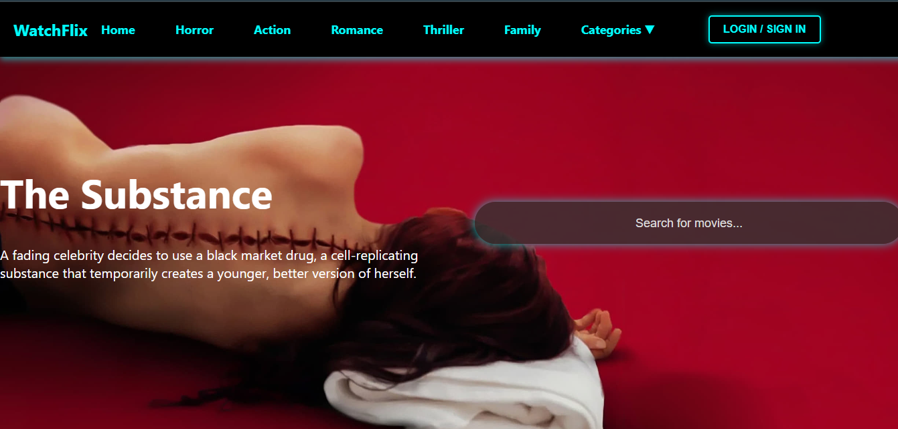
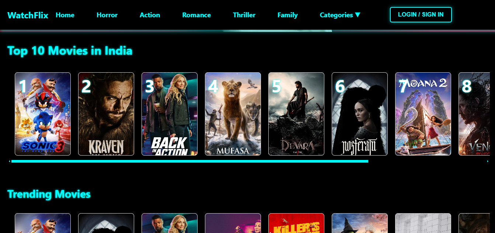
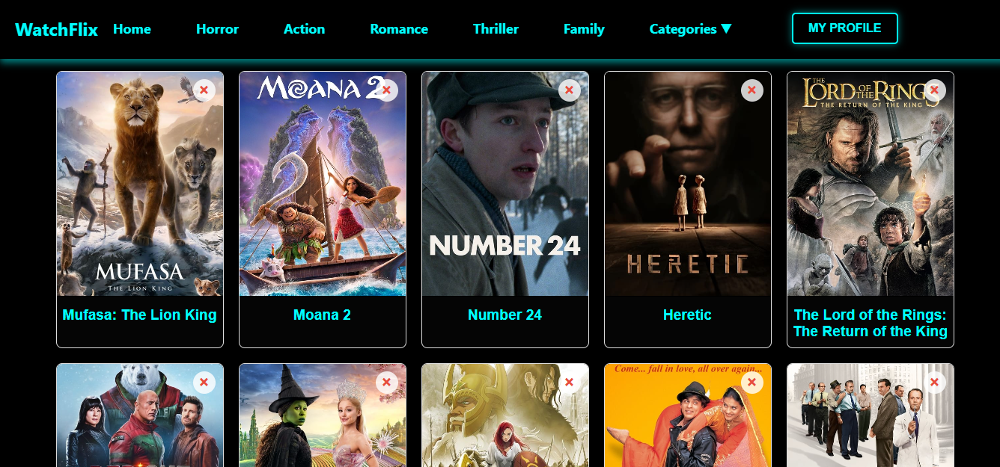
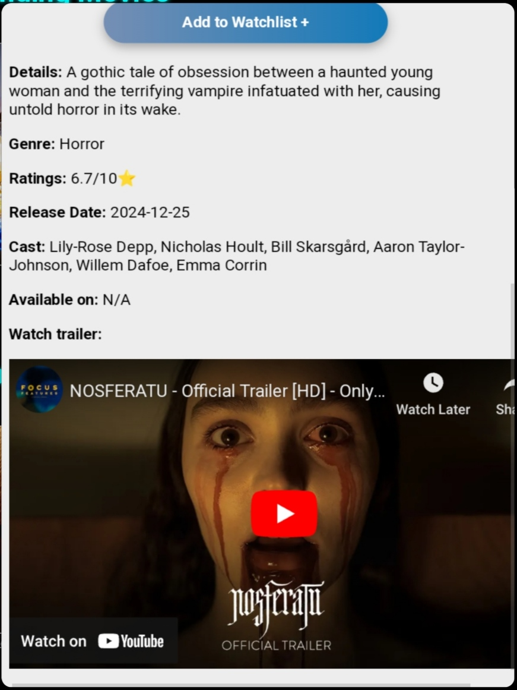
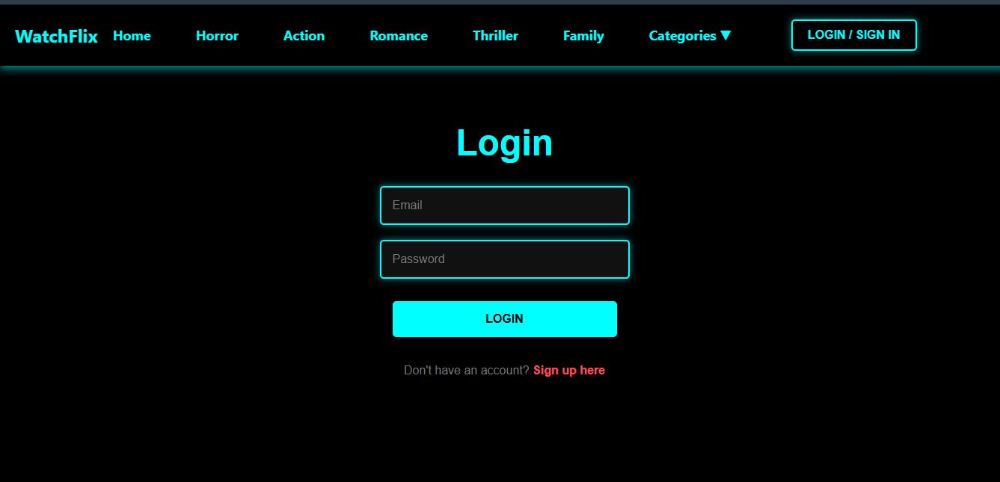

# 🎬 WatchFlix - Your Personalized Movie Recommendation System

**WatchFlix** is an innovative movie recommendation system built with **React.js**, designed to provide users with personalized movie suggestions based on their preferences. This responsive web application is powered by modern frontend technologies and integrates seamlessly with external APIs to deliver real-time movie data. You can try out the live version of the app here:

🌐 [WatchFlix - Live Demo](https://watch-flix7.vercel.app)

---

## 🚀 Features

1. **Dynamic Movie Recommendations**  
   - Browse trending, top-rated, and upcoming movies.
   - Receive personalized movie suggestions based on genre and popularity.

2. **Search Functionality**  
   - Quickly search for any movie by title and discover relevant details like plot, ratings, and more.

3. **Detailed Movie Information**  
   - Access in-depth movie details including:
     - Title, overview, and release date.
     - Ratings and popularity metrics.
     - Genre classifications.

4. **User Authentication**  
   - **Sign up/Login** with email/password using Supabase.
   - **Google OAuth Integration** for a seamless login experience.

5. **Watchlist Management**  
   - Add movies to a personal watchlist for future viewing.
   - Save and manage watchlists persistently for each user in the database.

6. **Responsive Design**  
   - Fully optimized for desktop, tablet, and mobile devices.

---

## 📸 Screenshots

### Home Page  
_Showcases trending movies, search bar, and user-specific recommendations._  
  
  

### Watchlist  
_A personalized collection of movies saved by the user._  
  

### Movie Details  
_In-depth details of a selected movie._  
  

### Login Page  
_Simple and secure login interface._  
  


## 🛠️ Tech Stack

### Frontend
- **React.js**: A robust JavaScript library for building the user interface.
- **React Router**: For seamless navigation and routing between pages.
- **Axios**: For API requests and data fetching.
- **Tailwind CSS**: For sleek, modern, and responsive styling.

### Backend
- **Supabase**: Backend-as-a-service for authentication and user data management.

### APIs
- **The Movie Database (TMDB)**: For fetching movie data such as titles, posters, descriptions, ratings, and more.

---
## 🌟 Key Highlights

- **User-Friendly UI**: An intuitive design ensuring a seamless user experience.
- **Real-Time Data**: Fetches up-to-date movie details from TMDB API.
- **Scalability**: Built with modern tools, making it easy to extend features in the future.


## 📈 Future Enhancements

- Add a recommendation algorithm to suggest personalized movies based on user preferences.
- Enable user reviews and ratings for movies.
- Incorporate dark mode for better accessibility and user customization.
- Expand to support TV shows and documentaries.

---

## 🤝 Contributing

Contributions are welcome! If you'd like to contribute, please follow these steps:

1. Fork the repository.
2. Create a new branch (`feature/your-feature-name`).
3. Commit your changes and push.
4. Open a Pull Request.

---

## 📄 License

This project is licensed under the **MIT License**. See the `LICENSE` file for details.

---

## 🎉 Acknowledgments

- **[The Movie Database (TMDB)](https://www.themoviedb.org/)** for providing the movie data API.
- **[Supabase](https://supabase.com/)** for seamless backend integration.
- **[React.js](https://reactjs.org/)** and the amazing open-source community for building the tools we rely on.

## Setup

### Prerequisites

- Node.js and npm installed on your machine.

### Install Dependencies

1. Clone the repository:

    ```bash
    git clone https://github.com/Ridhyka/WatchFlix.git
    ```

2. Navigate to the project directory:

    ```bash
    cd WatchFlix
    ```

3. Install the dependencies:

    ```bash
    npm install
    ```

4. Set up your environment variables:
   
    Create a `.env` file in the root directory and add your API key for TMDb:

    ```bash
    REACT_APP_TMDB_API_KEY=<your-api-key>
    ```

    You can get an API key by signing up at [TMDb](https://www.themoviedb.org/).

### Run the App

Start the development server:

```bash
npm run dev
```

